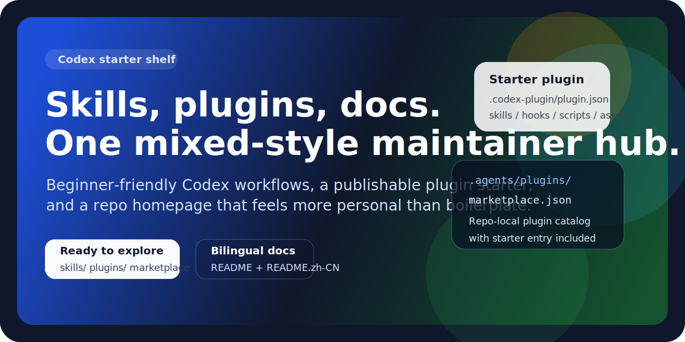

<p align="center">
  
</p>

<p align="center">
  <a href="./README.md">English</a> ·
  <a href="./CONTRIBUTING.zh-CN.md">贡献说明</a> ·
  <a href="./plugins/codex-starter/.codex-plugin/plugin.json">插件模板</a>
</p>

<p align="center">
  
  
  
</p>

# Codex Skills 与 Plugins

这是一个偏“作者主页”气质的 Codex 仓库：既放可复用的 skills，也放可发布的插件模板，同时尽量对第一次接触 Codex 的人友好。

这个仓库不是纯模板仓库，也不是纯文档站，而是把“实用工具箱”“可发布结构”“好读的主页”揉在一起，方便你后续继续扩展成自己的 Codex 生态。

## 从这里开始

| 你想做什么 | 去这里 |
| --- | --- |
| 直接复用已经写好的 skills | [`skills/`](./skills) |
| 了解文档摄取与恢复流程 | [`skills/document-ingestion-and-recovery`](./skills/document-ingestion-and-recovery) |
| 安全提取 `.docx` 文档 | [`skills/markitdown-docx-extraction`](./skills/markitdown-docx-extraction) |
| 使用一个可发布的插件模板 | [`plugins/codex-starter`](./plugins/codex-starter) |
| 配置仓库级插件市场清单 | [`.agents/plugins/marketplace.json`](./.agents/plugins/marketplace.json) |
| 参与修改或继续扩展 | [`CONTRIBUTING.zh-CN.md`](./CONTRIBUTING.zh-CN.md) |

## 这个仓库有什么特点

- 不只是模板，也内置了真实可用的 skills
- 自带符合 Codex 约定的 starter plugin 结构
- 中英文双文档入口，对新手更友好
- 适合做成带个人风格的 GitHub 项目主页，而不只是一个冷冰冰的代码仓库

## 仓库结构

```text
.agents/plugins/   仓库内插件市场元数据
assets/            仓库视觉资源
plugins/           插件模板与未来插件
skills/            可复用的 Codex skills
```

## 当前包含的 Skills

### `document-ingestion-and-recovery`

- 对 `markitdown` 支持的格式优先走 `markitdown`
- 按文件类型做提取结果验收
- 在提取结果质量下降时，按需走 OCR 或更低层补救

### `markitdown-docx-extraction`

- 专注于 `.docx` 文档提取流程
- 避免过早进入 ZIP/XML 低层解析
- 鼓励先生成可读的 Markdown 旁路文稿，再进入后续分析

## 当前包含的插件模板

### `plugins/codex-starter`

这个插件模板刻意保持轻量，但已经足够像一个“可发布起点”：

- 包含 `.codex-plugin/plugin.json`
- 预留了 `skills`、`scripts`、`hooks`、`assets` 目录
- 预留了 `.mcp.json` 与 `.app.json`
- 已经写入本仓库的 marketplace 清单

后续你要做自己的插件时，可以直接从这里改，而不是每次重新手搓结构。

## 快速使用

### 本地使用 skills

把 [`skills/`](./skills) 里的目录复制到 `$CODEX_HOME/skills` 或 `~/.codex/skills` 下。

### 本地使用插件模板

把 [`plugins/codex-starter`](./plugins/codex-starter) 复制到你的 Codex 插件目录，然后按需改 [`plugin.json`](./plugins/codex-starter/.codex-plugin/plugin.json) 里的占位信息。

## 给新手的友好说明

- GitHub 上通常不会像 B 站那样有统一的“UP主”称呼，更常见的是 `作者`、`开发者`、`维护者`。
- 如果你是第一次接触 Codex，建议先从 skills 开始；插件模板适合你开始搭自己生态时再用。
- 如果 Windows 终端里看到中文乱码，先在支持 UTF-8 的编辑器里确认文件内容，不要第一时间判断文件本身损坏。

## 许可协议

本仓库采用 [MIT License](./LICENSE)。
